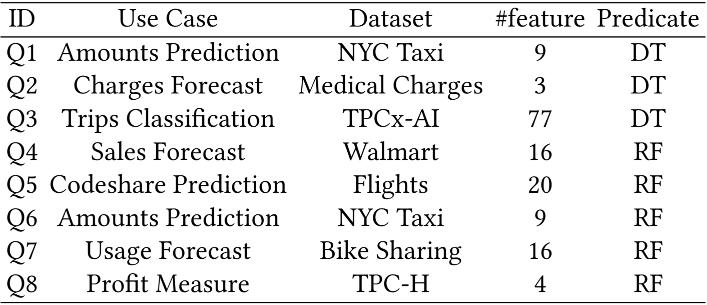

# ReTree Experiments

This document outlines the experimental components of our paper *Eliminating Redundant Feature Tests in Decision Tree and Random Forest Inference on SQL Predicates*.

## What is ReTree

ReTree is a flexible and pluggable extension implemented on top of DuckDB. It is designed to eliminate redundant feature tests in decision tree and random forest predicates. The source code is located in the `duckdb` submodule, with the core implementation primarily in `duckdb/test/extension/retree_xxx_extension.cpp`.

## Experiments in Our Paper

In this paper, we evaluate the performance of the ReTree prototype system through a series of experiments conducted on publicly available datasets and standard benchmark workloads, including TPC-H and TPCx-AI. The experiments include:

- Efficiency of Sibling-Centric Elimination
  - End-to-end execution time
  - Evaluation overhead analysis
  - Selectivity of ML predicates
- Efficiency of Ancestor-CentricElimination
  - End-to-end execution time
  - Evaluation overhead analysis
  - Impact of different sliding hyperplane types
- Accuracy of Random Forest Predicates
- Comparison with Alternative Approaches

## Workloads

The `workloads` directory contains eight datasets: `bike_sharing_demand`, `flights`, `medical_charges`, `nyc-taxi-green-dec-2016`, `walmart_sales`, and `wine_quality`.

In each dataset folder:

- The `xxx.csv` file contains the original dataset.
- The `train_xxx.py` scripts are used for training machine learning models.
- Data scaling is achieved by replication via the `data/xxx_expand.py` scripts.

The `tpch-q9` and `tpcxai-uc08` directories include only model training scripts, as the full datasets are too large to be included directly. The TPC-H dataset can be generated using the official TPC-H toolkit available at [https://www.tpc.org/tpch/ ](https://www.tpc.org/tpch/) and TPCx-AI dataset can be obtained using the TPCx-AI toolkit from [https://www.tpc.org/tpcx-ai/ ](https://www.tpc.org/tpcx-ai/).

## Queries

Each dataset directory include `common/xxx.sql` file that contain SQL statements to load the ReTree extension. The experimental prediction queries are stored in `workload/xxx/query.sql`, corresponding to the queries described in the evaluation section of our paper, as shown in the following table.

